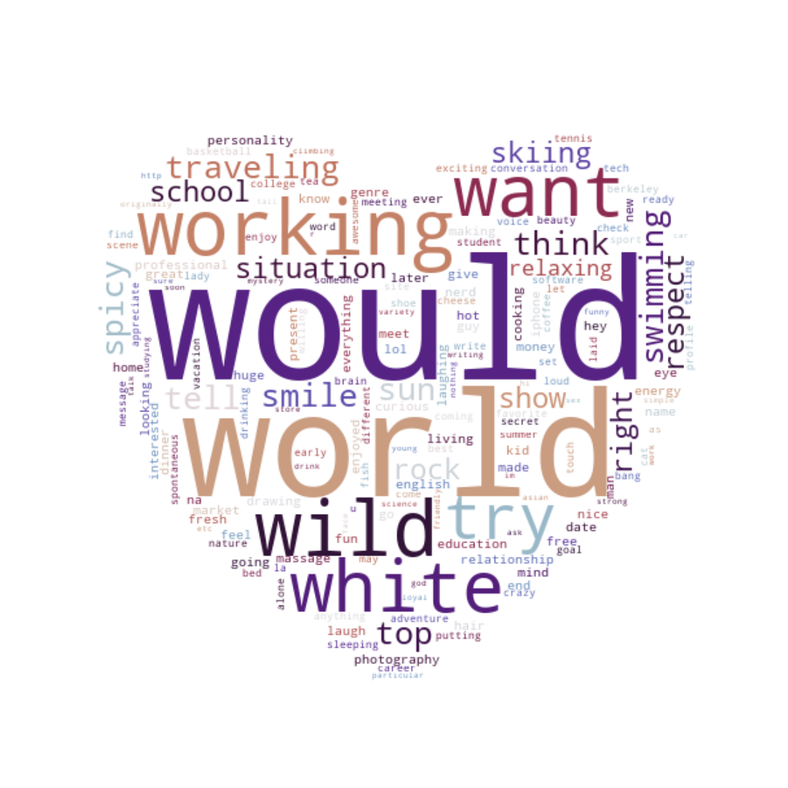
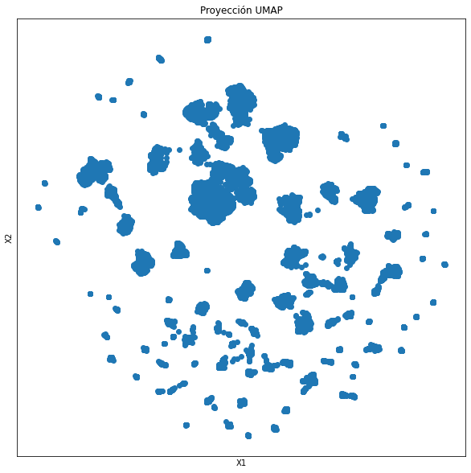
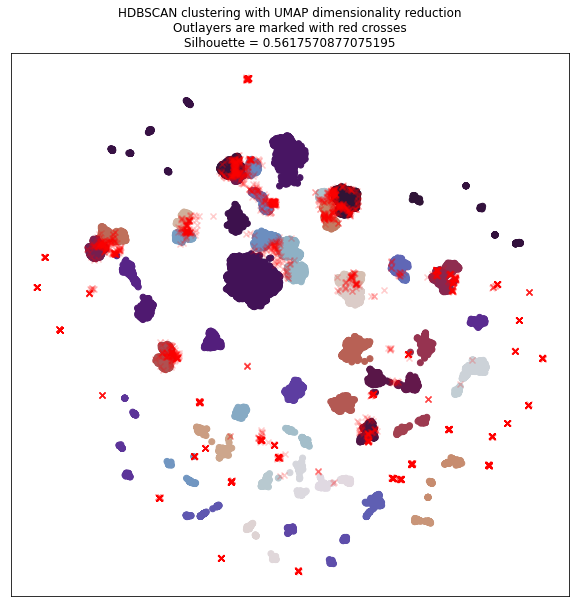
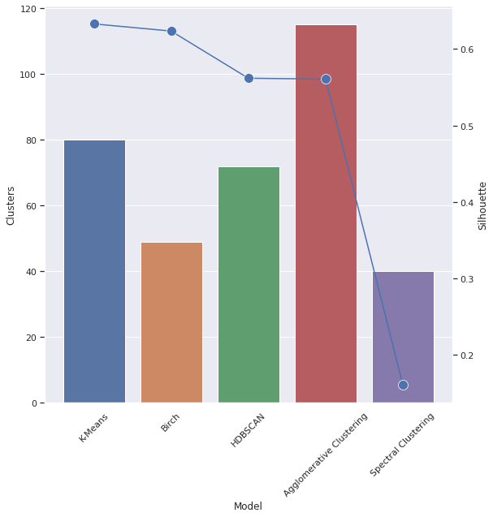

# OkCupid Clustering

This notebook is an exercise that tries to visualize different OkCupid profiles and group them into clusters.
In order to achieve that, we used different tools and algorithms as tf-idf Vectorizer, UMAP, K-Means or HDBSCAN among others.

Here there are some of the results of the analysis but you can find more on the notebook.

### Most Relevant Words using tf-Idf vectorizer

### Dimensionality Reduction with UMAP

    

### HDBSCAN Clustering

    

### Clustering Model Silhouette Comparison

    

